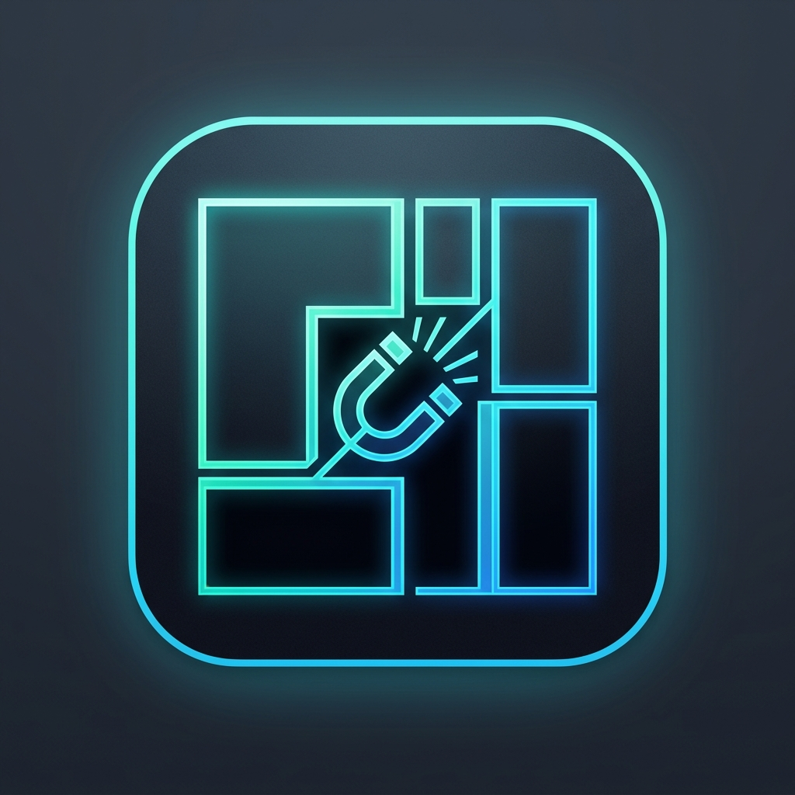
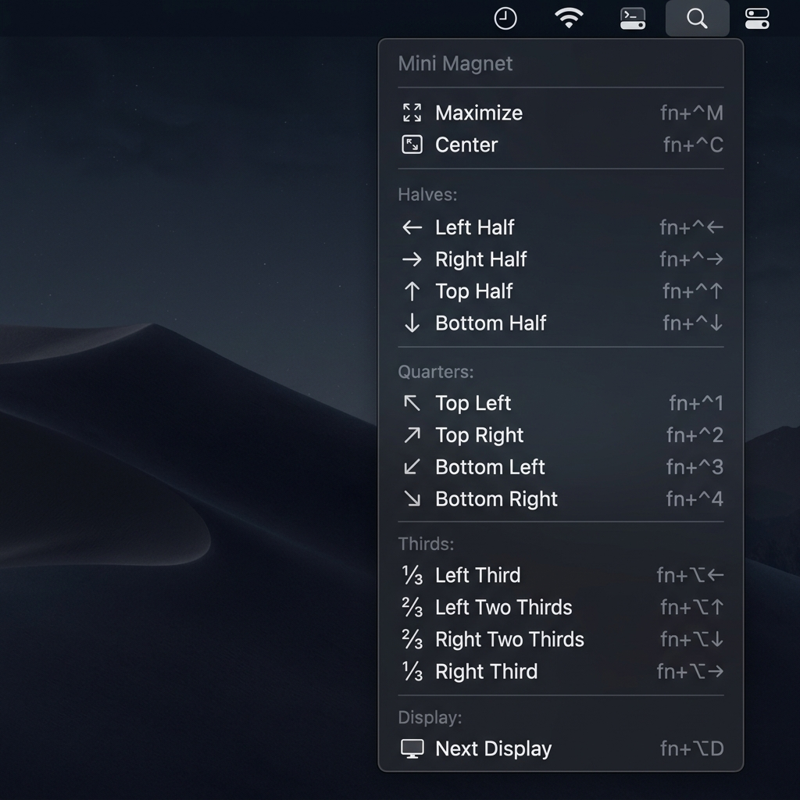
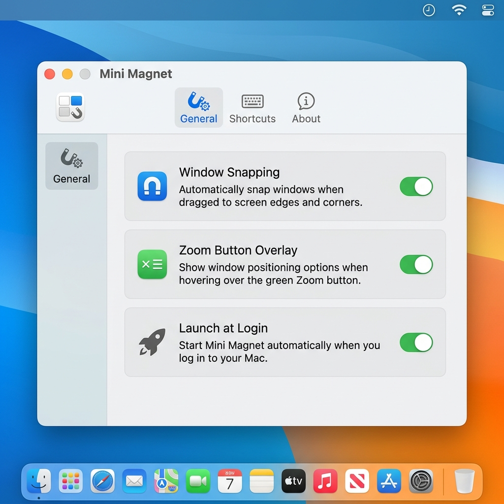
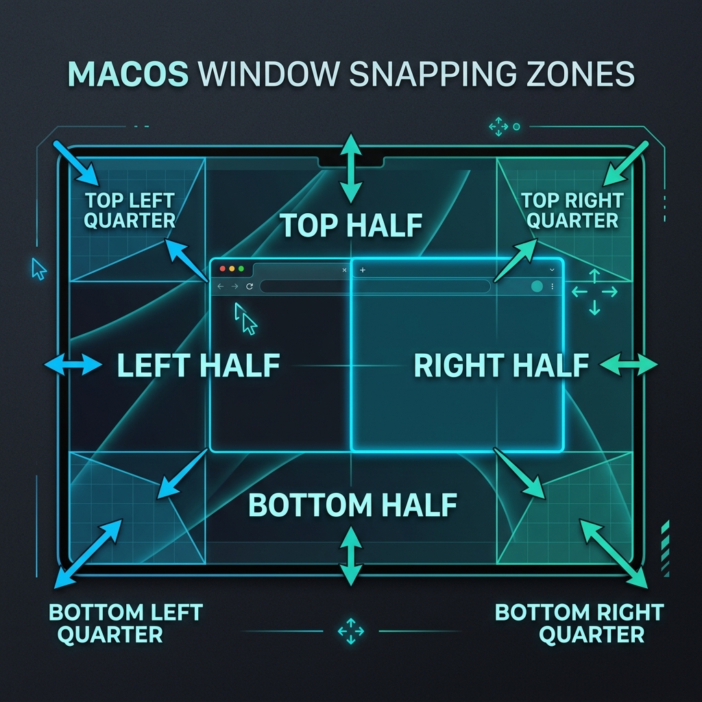

<p align="center">
  
</p>

<h1 align="center">Mini Magnet</h1>

<p align="center">
  <strong>A lightweight, native window manager for macOS</strong><br/>
  Snap, resize, and organize windows with keyboard shortcuts or drag-to-edge snapping.<br/>
  Built entirely in Swift — no Electron, no dependencies, just pure performance.
</p>

<p align="center">
  
  
  
  
</p>

---

## ✨ Features

- 🪟 **Window Tiling** — Halves, quarters, thirds, two-thirds, maximize, and center
- 🧲 **Edge Snapping** — Drag windows to screen edges/corners for instant snapping
- 🟢 **Zoom Button Overlay** — Hover the green titlebar button for a quick layout picker
- ⌨️ **Global Keyboard Shortcuts** — Fully customizable hotkeys for every layout action
- 🖥️ **Multi-Display Support** — Move windows between displays with a shortcut
- ⚡ **Launch at Login** — Start automatically when you log in
- 🎨 **Native macOS Design** — Uses SF Symbols, system blur effects, and native controls
- 🪶 **Ultra Lightweight** — Under 2MB, pure Swift, zero dependencies

---

## 📸 Preview

<p align="center">
  
  &nbsp;&nbsp;&nbsp;
  
</p>

<p align="center">
  
</p>

---

## ⌨️ Default Keyboard Shortcuts

| Action | Shortcut |
|--------|----------|
| **Maximize** | `⌃ ⌥ ↑` |
| **Center** | `⌃ ⌥ ↓` |
| **Left Half** | `⌃ ⌥ ←` |
| **Right Half** | `⌃ ⌥ →` |
| **Top Half** | `⌃ ⌥ ⇧ ↑` |
| **Bottom Half** | `⌃ ⌥ ⇧ ↓` |
| **Top Left Quarter** | `⌃ ⌥ U` |
| **Top Right Quarter** | `⌃ ⌥ I` |
| **Bottom Left Quarter** | `⌃ ⌥ J` |
| **Bottom Right Quarter** | `⌃ ⌥ K` |
| **Left Third** | `⌃ ⌥ D` |
| **Center Third** | `⌃ ⌥ F` |
| **Right Third** | `⌃ ⌥ G` |
| **Left Two Thirds** | `⌃ ⌥ E` |
| **Right Two Thirds** | `⌃ ⌥ T` |
| **Next Display** | `⌃ ⌥ ⌘ →` |
| **Previous Display** | `⌃ ⌥ ⌘ ←` |

> All shortcuts are fully customizable in **Settings → Shortcuts**.

---

## 🚀 Installation

### Build from Source

**Requirements:** macOS 11.0+, Swift 6.0+, Xcode Command Line Tools

```bash
# Clone the repository
git clone https://github.com/minlong8111/mini-magnet.git
cd mini-magnet

# Build and create the app bundle
chmod +x build.sh
./build.sh

# Launch the app
open MiniMagnet.app
```

### First Launch

1. macOS will prompt you to grant **Accessibility** permission
2. Go to **System Settings → Privacy & Security → Accessibility**
3. Enable **MiniMagnet**
4. The app will appear in your **menu bar** with a 🧲 magnet icon

---

## 🏗️ Project Structure

```
mini/
├── Package.swift                    # Swift Package Manager config
├── build.sh                         # Build script (compile + bundle .app)
├── Sources/mini/
│   ├── mini.swift                   # App entry point, menu bar, hotkey registration
│   ├── WindowManager.swift          # Core window positioning via Accessibility API
│   ├── HotkeyManager.swift          # Global hotkey registration (Carbon Events)
│   ├── SnappingManager.swift        # Edge/corner snapping on mouse drag
│   ├── TitlebarHoverManager.swift   # Zoom button hover overlay panel
│   ├── SettingsView.swift           # SwiftUI settings window
│   ├── ShortcutModel.swift          # Shortcut data model & utilities
│   └── Resources/
│       ├── AppIcon.png              # App icon source
│       └── MenuBarIcon.png          # Menu bar icon (fallback)
└── assets/                          # README preview images
```

---

## 🛠️ Tech Stack

| Component | Technology |
|-----------|------------|
| Language | Swift 6 (Strict Concurrency) |
| UI Framework | SwiftUI + AppKit |
| Window Management | macOS Accessibility API (AXUIElement) |
| Global Hotkeys | Carbon Event Manager |
| Build System | Swift Package Manager |
| Minimum OS | macOS 11.0 (Big Sur) |

---

## 📄 License

MIT License — feel free to use, modify, and distribute.

---

<p align="center">
  Made with ❤️ for macOS
</p>
